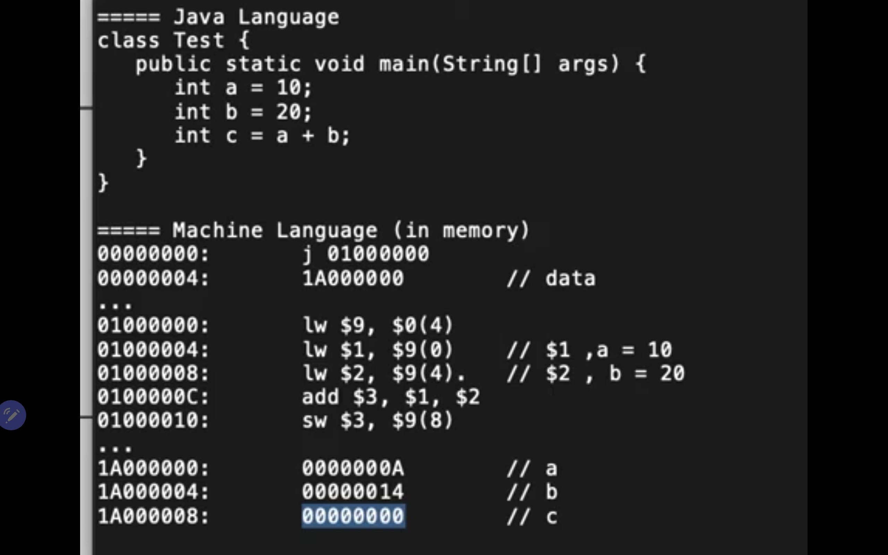
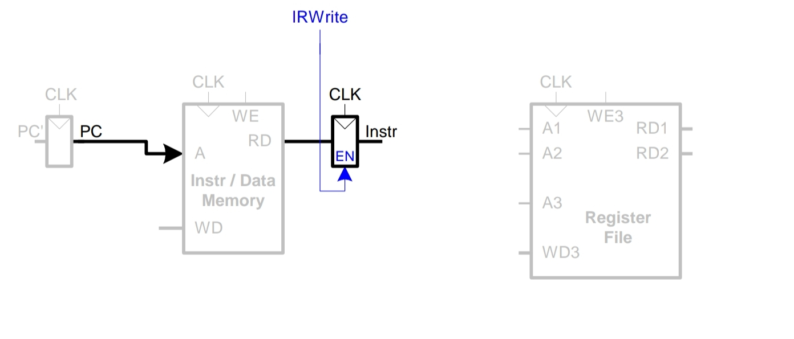
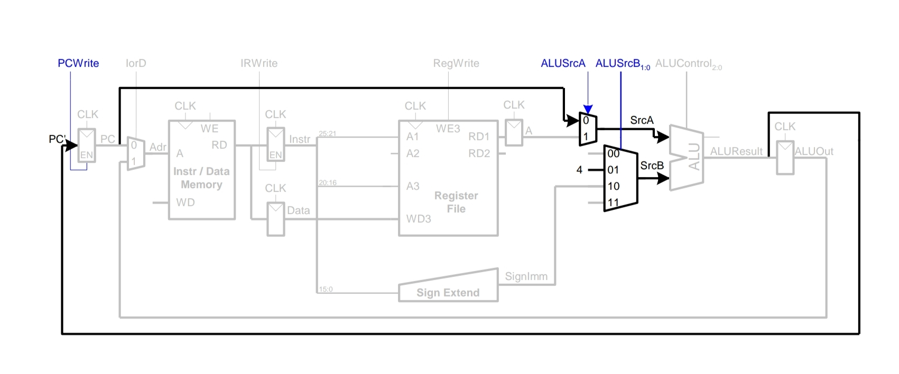
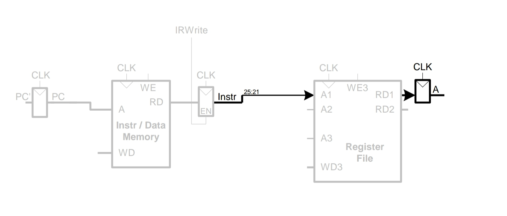
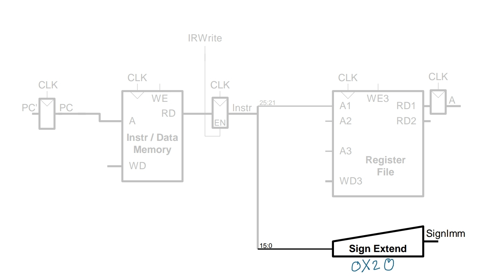
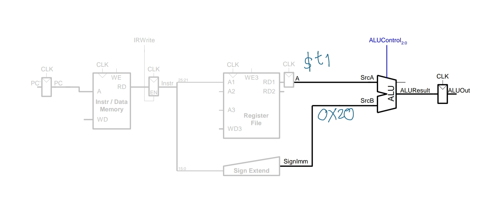
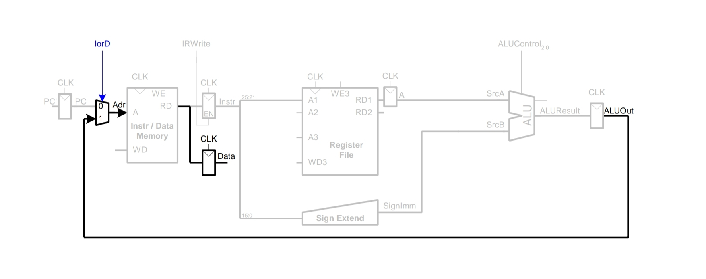
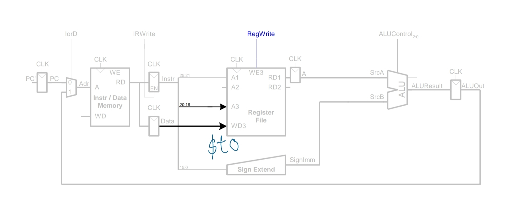

#                                                              CN210

### หัวข้อที่1. คำสั่ง Add ใน R-type
 [วิดีโอที่1 คำสั่งadd ใน R-type](https://youtu.be/pT1bIVJNtd4)
 คำสั่งใน MIPS มีทั้งหมด 3 ประเภท ประกอบด้วย R-format, I-format และ J-format ซึ่งแต่ละคำสั่งมีขนาด 32 บิท 

* ประเภทที่ 1  R-format  มีทั้งหมด 6 ส่วน คือ
1. op หรือ opcode (เลข 6 บิทแรก) หมายถึง ระบุการดำเนินการ ในประเภท R-format คือเลข 000000 
2. rs (5 บิท) หมายถึง รีจิสเตอร์ตัวแรก
3. rt (5 บิท) หมายถึง รีจิสเตอร์ตัวที่ 2
4. rd (5 บิท) หมายถึง รีจิสเตอร์ตัวที่เก็บผลลัพธ์จากการกระทำของ rs และ rt
5. shamt (5 บิท) หมายถึง จำนวนบิทที่ต้องการ shift แต่หากไม่มีการshift ค่าshamtจะเป็น 00000
6. funct (5 บิท) หมายถึง ระบุคำสั่งใน R-format ที่จะให้rs กระทำกับ rt
 ตัวอย่าง ADD $5,$1,$2  rs =$1 =00001, rt =$2 =00010, rd =$5 =00101

| op | rs | rt | rd | shamt | func |
|-----|------|------|------|------|------|
|000000|00001|00010|00101|00000|10000|

* ประเภทที่ 2  I-format  มีทั้งหมด 4 ส่วน คือ
1. op หรือ opcode (เลข 6 บิทแรก) หมายถึง ระบุการดำเนินการ สำหรับ loadword=100011, storeword=101011 และBeq=000100
2. rs (5 บิท) หมายถึง รีจิสเตอร์ที่จะนำค่าไปรวมกับ offset
3. rt (5 บิท) หมายถึง รีจิสเตอร์ที่จะนำค่าไปเก็บ
4. offset (16 บิท) 
* ประเภทที่ 3  J-format  มีทั้งหมด 2 ส่วน คือ
1. op หรือ opcode (เลข 6 บิทแรก) หมายถึง ระบุการดำเนินการ 
2. address (เลข 26 บิท) หมายถึง ตำแหน่งที่จะกระโดดไป

### หัวข้อที่2.How CPU Work
 [วิดีโอที่2 ขั้นตอนการทำงานของCPU](https://youtu.be/X4YcjFMqclM)

 **จากรูปภาพด้านบนจะมีการบวกกันของ a และ b ในภาษาจาวา และการทำงานแบบเดียวกันในภาษาที่คอมพิวเตอร์เข้าใจ**
* ในบรรทัดแรกของMachine language : j 01000000 หมายถึงให้กระโดดไปทำคำสั่งตำแหน่ง 01000000 ก็คือบรรทัด3 ที่เก็บคำสั่งloadwordไว้
* บรรทัดที่ 3 lw $9, $0(4) หมายถึง นำข้อมูลใน 00000004 ที่อยู่ในบรรที่2 ก็คือ 1A000000 เก็บในรีจิสเตอร์ 9 
* บรรทัดที่ 4 lw $1, $9(0) หมายถึง นำข้อมูลในตำแหน่ง 1A000000 คือ 0000000A ค่าa ที่เท่ากับ10ในฐาน16 เก็บในรีจิสเตอร์ 1
* บรรทัดที่ 5 lw $2, $9(4) หมายถึง นำข้อมูลในตำแหน่ง 1A000000บวกไป 4 บิท ก็คือ 1A000004 ซึ่งเก็บค่าฺb ที่เท่ากับ00000014 หรือ20 ในฐาน10 เก็บในรีจิสเตอร์ 2
* บรรทัดที่ 6 add $3, $1, $2 หมายถึง นำข้อมูลใน รีจิสเตอร์1 และ รีจิสเตอร์2 บวกกัน แล้วนำค่าไปเก็บใน รีจิสเตอร์3
* บรรทัดที่ 7 sw $3, $9(8) หมายถึง นำข้อมูลในรีจิสเตอร์3 เก็บค่าในตำแหน่ง 1A000000 บวก8 คือ1A000008 เก็บค่าผลลัพธ์ ค่า c ที่เท่ากับ30

### หัวข้อที่3. Multi-cycle VS Single-cycle
 [วิดีโอที่3 การเปรียบเทียบระหว่าง Multi-cycle และ single cycle](https://youtu.be/f6bQtnDyrzQ)

* ในSingle-cycle ประกอบด้วย 2 Memoryที่แยกเก็บระหว่างคำสั่งและข้อมูล, 4.0 Muxes, 1 ALU, 2 adders
* Clock cycle ในSingle-cycle ใช้ระยะเวลา 8 ns
* ซึ่งการมี 2 addersและ 1 ALU ทำให้เปลืองพื้นที่ชิพและไม่สามารถนำresourceกลับมาใช้ใหม่ได้
* การแยก Memoryระหว่างคำสั่งและข้อมูล แบบHarvard architecture ทำให้เปลืองMemory

 **ทำให้พัฒนามาเป็น Multi-cycle**

* ใน Multi-cycle ประกอบด้วย 1 Memory, 5.5 Muxes, 1 ALU, 5 Register(ประกอบด้วย A, B,Instruction register, Memory data register, ALUOut)
* Clock cyle ในMulti-cycle ใช้ระยะเวลา 6 ns สำหรับคำสั่งadd, 8 ns สำหรับ loadword, 7 ns สำหรับ storeword, 5 ns สำหรับ branch of equal และ 2 ns สำหรับ คำสั่งjump
* ALU ใช้สำหรับ บวก4ให้PC และ คำนวณหาaddress ซึ่งมีการreuse functional Unit
* Memory มีการreuse สำหรับ คำสั่งและข้อมูล แบบVon nueman architecture

### หัวข้อที่4. Load word in Multi-cycle

 [คลิปวิดีโอที่4 คำสั่งloadword ในMulti-cycle](https://youtu.be/DK0LAkcEjHc)
 **5 ขั้นตอนของloadword ในMulti-cycle**
1. ขั้นตอนที่1 การเอาคำสั่งจากmemory ไปยัง instruction register และในขณะเดียวกัน PC = PC+4

2. ขั้นตอนที่2 การถอดรหัสคำสั่ง เอาค่าในรีจิสเตอร์ของrs ไปพักไว้ใน A  

3. ขั้นตอนที่3 นำค่าoffset ไปsign extend และนำ offsetและ rsคำนวณในALU

4. ขั้นตอนที่4 นำผลลัพธ์ออกจากALUOut เข้าถึงที่Memory data register

5. ขั้นตอนที่5 อ่านค่าจากMemory data register ลงรีจิสเตอร์

 **หัวข้อที่5. Branch of Equal in Multi-cycle**

 [วิดีโอที่5 คำสั่งBEQ ในMulti-cycle](https://youtu.be/Eh2OFieFIFA)
 **คำสั่ง branch of equal คือ การกระโดดแบบมีเงื่อนไข กระโดดเมื่อrs-rt=0 หรือ rsม่ีค่าเท่ากับrt**
* beq $rs $rt offset
1. ขั้นตอนที่1 การเอาคำสั่งจากmemory ไปยัง instruction register และในขณะเดียวกัน PC = PC+4
2. ขั้นตอนที่2 การถอดรหัสคำสั่ง เอาค่าในรีจิสเตอร์ของrs, rt ไปพักไว้ใน A, B
3. ขั้นตอนที่3 นำค่าที่พักในA,B คำนวณในALUว่า rs-rt=0ไหม ถ้าเท่ากันจะกระโดด ซึ่งกระโดดไปที่ PC=ALUOut

 **หัวข้อที่6. FSM controller in Multi-cycle**

 [วิดีดอที่6 FSM controller ในMUlti-cycle](https://youtu.be/zDQW-HyqBxg)

 **หัวข้อที่7. Pipelining**

 [วิดีโอที่7 Pipelining](https://youtu.be/3Bm1NIazgtc)
